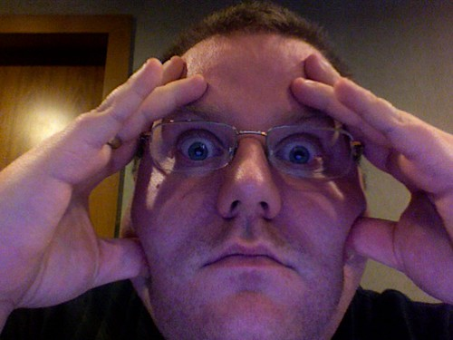

I'm in chilly Cambridge, MA this week for the annual W3C Technical Plenary. I've spent the last two days in the CSS Working Group discussing the future of things, issues, and debating the relative merits of x vs. y. Now that I have a camera built in to my laptop, I decided to take a [little photo diary during the day](http://www.flickr.com/photos/kplawver/sets/72157602966045156/).\\ I'll try to remember to continue the diary today during plenary day and the rest of the week while I'm hanging out covering for [Arun](http://www.arunranga.com/blog/) in the WebAPI group.
