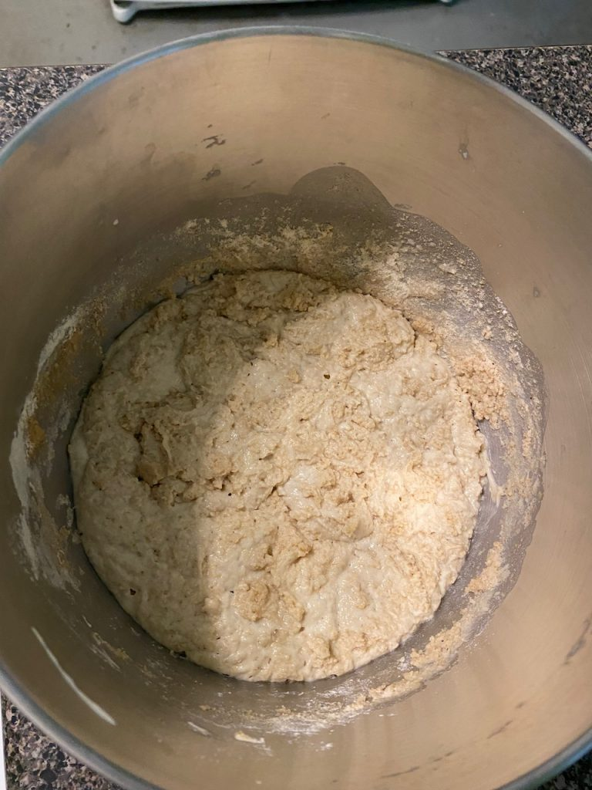
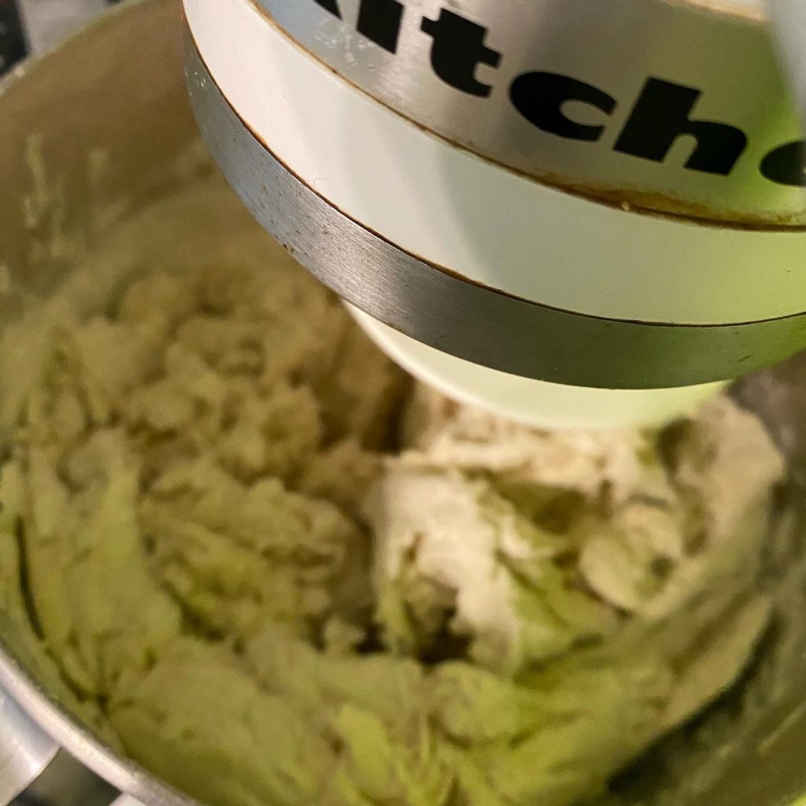
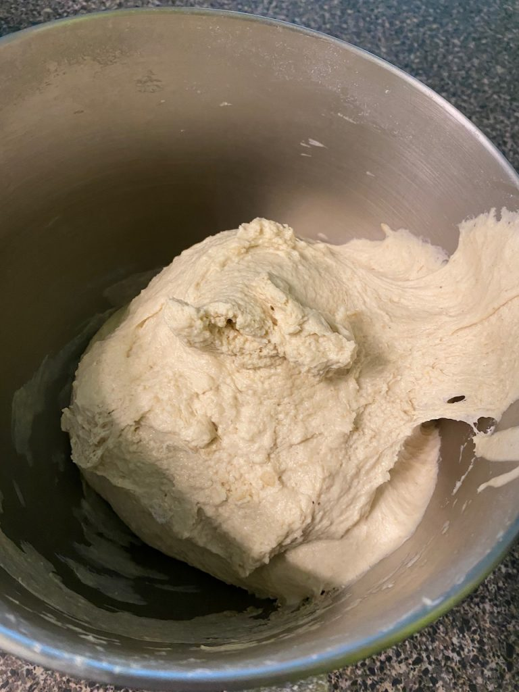
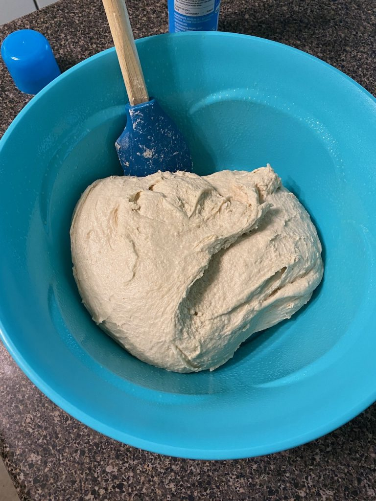
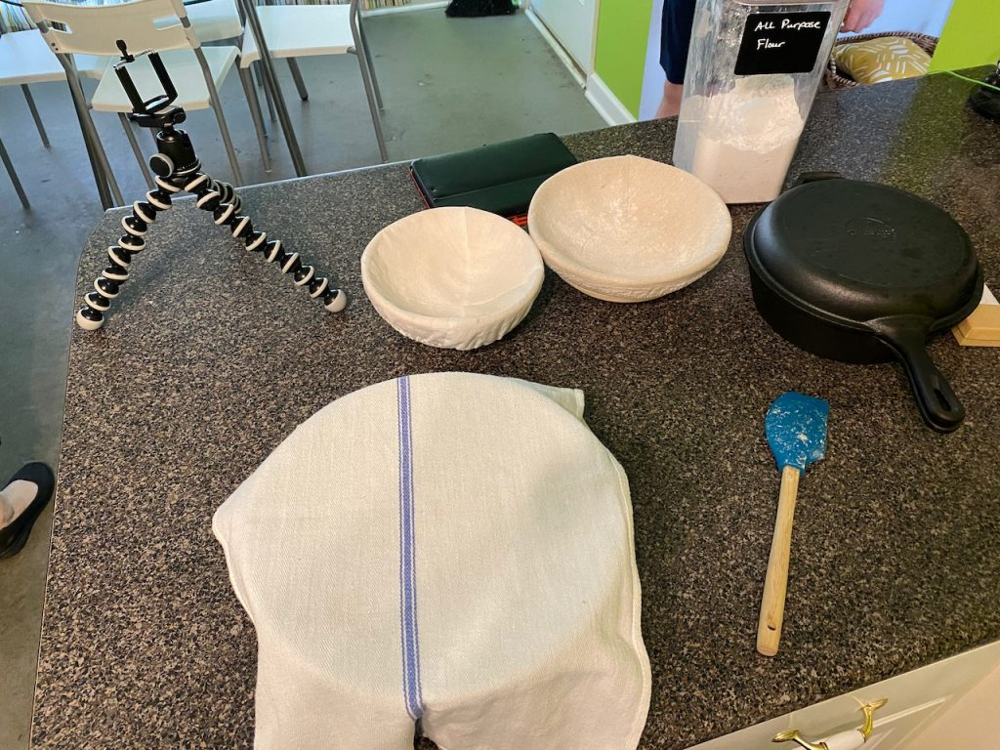
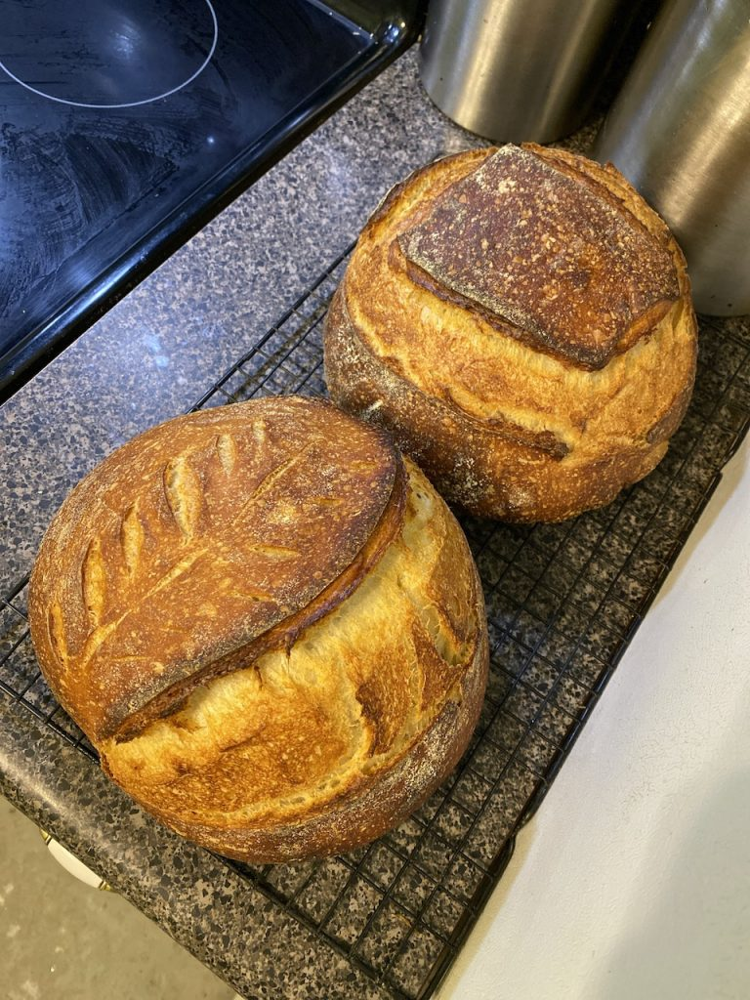

Due to the outrageous demands of about three people, I did another episode of **Baking With Kevin**, this time about sourdough and walking through my [all-time favorite recipe](https://www.kingarthurflour.com/recipes/pain-au-levain-recipe) (including the tweaks I've made to it over the years I've been making it).

This was my first time trying out Facebook Live and other than the video being portrait, it wasn't horrible. I could actually see peoples' comments and questions as I was working, which was easier than the previous Google Meet-based (OK, totally calling it _Meetspace_ from now on) episode. It's still really weird essentially talking to myself.

I posted these to the Facebook event before I started the video, because the process takes so long, the only live demo part was dividing the dough and forming loaves. So, now you get to see them, and the video at the bottom! Lucky you.

<figure>

<figcaption>

I mix up my levain in the mixing bowl, because... why dirty more than one bowl?

</figcaption>

</figure>

<figure>

<figcaption>

After mixing all the ingredients together, I let it autolyse (give the flour more time to absorb the water) for an hour, which is twice as long as the recipe calls for. I've found it makes kneading a lot easier.

</figcaption>

</figure>

<figure>

<figcaption>

This is what my dough looks like after kneading. It should be sticky. I usually pry it out of the bowl with my hard spatula.

</figcaption>

</figure>

<figure>

<figcaption>

Hey, there's my awesome spatula! And some dough ready to bulk ferment!

</figcaption>

</figure>

<figure>

<figcaption>

Everying in its place, ready to film the episode.

</figcaption>

</figure>

<figure>

<figcaption>

And here's the final product! I meant to take a picture of the cuts before baking, but I forgot. Next time.

</figcaption>

</figure>

The next episode will probably be [Michael Ruhlman's sandwich bread](https://ruhlman.com/2009/12/02/making-sandwich-bread-with-the-53-ratio/), since so many people are baking now just to pass the time, and avoid going to the store. If I can help them get a little more comfortable making bread, I guess that's something.

https://vimeo.com/402139743
