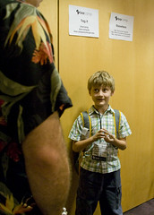

  
\\ by Kelly Gifford

(that's [Dr. Joe](http://drdzoe.wordpress.com) talking to Max)\\ Max and I went to [BarCampDC](http://barcampdc.com) this Saturday. BarCamp is an "un-conference" (no set schedule, everyone participates), and they're held all over the world. This one was organized by [Jason Garber](http://sixtwothree.org), [Jackson Wilkinson](http://jounce.net) and [Justin Thorp](http://oatmealstout.wordpress.com/). They did a _great_ job, and were cool with Max coming and participating.\\ I spoke on [Rails](http://rubyonrails.com), did the live coding demo I've done at other unconferences, and helped out in the portable social networking session.\\ Here are some links related to those sessions:

- [Ficlets, Rails and OpenID](http://presentations.lawver.net/philosophy/ficlets_rails_and_openid/) - I used this presentation during the intro to show off some of what Rails can do (also has some good [OpenID](http://openid.net) info).
- [Tapping the Portable Social Network](http://presentations.lawver.net/philosophy/mashup_university_tapping_the/) - Explains some of the concepts behind the prototype I put together, and
- [Portable Social Networks](/archive/2007/07/17/h12_portable_social_networks_at_mashup_camp.php) - The blog post that explains the prototype and presents the flow (and has a link to download the app).
    
    - [Brian Oberkirch's Portable Social Networking Post](http://www.brianoberkirch.com/2007/08/08/building-blocks-for-portable-social-networks/)
    - [Jeremy Kieth on Portable Social Networks](http://adactio.com/journal/1212) - The post that started me thinking about how to solve it.
- [The International Day of Awesomeness](http://dayofawesomeness.com) - Because I "sponsored" (on accident, I swear), I got to speak before one of the sessions. Of course, I spoke about The International Day of Awesomeness.\\ Now that's out of the way, let's talk about Max! When I originally asked Max if he wanted to go to BarCamp with me, I wasn't sure he'd want to go. We talked about it a couple times on the way to summer camp and the more he found out about it, the more excited he got. I was excited for him to see me give a presentation and see what it is that I do when I travel. He had a _great_ time. Everyone was really great with him. He was so excited to talk about [Scratch](http://scratch.mit.edu) and [Hackety Hack](http://hacketyhack.net) and to learn from everyone. He was by far the youngest attendee there (I mean, [Jason](http://sixtwothree.org) only _looks_ 15). He was insanely well-behaved, and other than him clicking markers together a couple times or tearing paper, he was as well-behaved as any of the adults. He zoned out a little bit in the afternoon, but I think most people did.\\ On the way home, we talked a lot about what he thought of the day. Even after almost twelve hours of non-stop geekdom (we left the house at 7:30AM and this was at about 7PM), he was asking when the _next_ BarCamp was going to be (in the last twenty-four hours, he's asked me when the next one is about ten times), and asking me if I'd help him do a presentation on animation and using **Hackety Hack**.\\ Thank you to everyone who sponsored BarCamp, helped organize things, presented, and talked to Max during the day. I can't tell you how cool it was to watch him talking to people and share his passion. It was great to share that with him, and to see him get out there. He said afterwards that he was a little shy in the morning, but that everyone was really nice. Max is an interesting kid, and I love seeing him learn and discover new things - and I love being able to share the things I'm passionate about with him.
