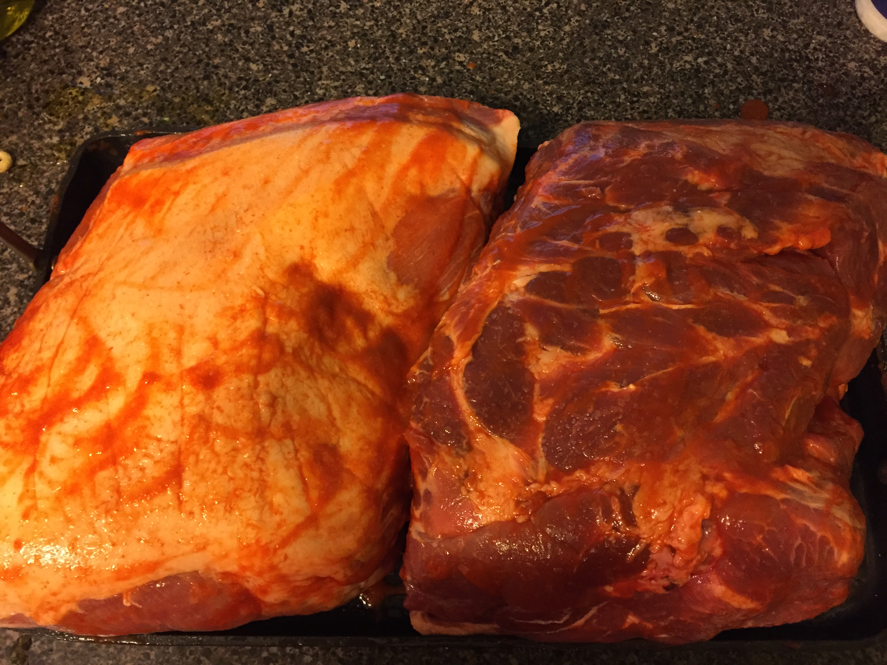
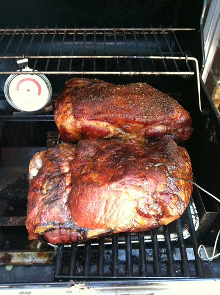
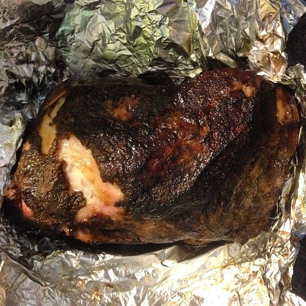

When I moved to Savannah, I had only ever been a consumer of fine smoked meats (you know, BBQ). I didn't know the difference between BBQ and "grilling". I was a poor unfortunate Yankee who didn't know what he was missing.

Thanks to my own personal BBQ Yoda (the one and only [Murray Wilson](https://twitter.com/murmini)), I got some education and now smoke my own meats regularly - usually pork shoulder (a "butt") but I've also smoked brisket, chicken, turkey and rabbits.

One of the most daunting things when I was just starting out was that I thought it would be really expensive to get started. Thankfully, I was wrong. Assuming you have even a small gas grill, you can make some delicious BBQ with some experimentation and tweaking (all reversible, of course) of your current equipment!

If you're going to buy anything, I'd highly recommend a [Maverick thermometer](http://amzn.to/1mt1ym0). It has a grill temp probe and one for the meat, and it's the easiest way to keep track of the fire and know when you meat is done that I've found (also the best balance between price and performance).

That's really the only thing you'll have to buy that's more than $20. Here's your parts list:

- A pork shoulder. The Kroger brand has always worked just fine for me, but you can go as crazy as you want - but when you're just starting out, I think cheaper is better in case something goes wrong.
- 10x13 disposable pan. You know, the big aluminum ones you take potato salad to picnics in. If you have a smaller grill, get one that will fit on one side.
- Two disposable pie pans.
- Hickory wood chips. Not chunks and not saw dust. You want chips.
- Cherry wood chips. Again, not chunks and not saw dust. You want chips.
- Your existing gas grill. You can use a charcoal grill, but I've never done that so... umm... find those instructions somewhere else.
- Olive oil
- Sriracha
- Raw sugar (though white will do)

In order to BBQ and not grill your meat, we need the following:

- Indirect heat
- Low, constant temperature ("low and slow")
- Good smoke

In order to do that, we need to take your existing grill and create a hot side and a meat side. The wood chips and fire will be on the hot side, and the meat on the other.

### The Night Before

- Clean your grill.
- Make sure you have a full propane tank as it can take up to 1/3 of a tank (or more depending on how well your grill retains heat) for a single BBQ session.
- If you have lava rocks you use to keep things even, use them. If not, you might want to get some.
- On one side of your grill (left or right, doesn't really matter), take the grate off and put the disposable pan right on top of the burner, then replace the grate (the meat will go on top of the grate over the pan so you don't have pork fat running all over the button of your grill... and there will be a _lot_ of pork fat).
- In each of your disposable pie pans, put half hickory and half cherry chips in and then cover with water. Put them some place out of the way so they can soak overnight.
- Go to bed.

### In The Morning.

You'll definitely want to start as early as you can, because they're not kidding about BBQ being "low and slow".

Before you put the meat on in the morning:

- Put one of the pans of wood chips on the hot side on top of the grill grate. You should cover the pie pan with aluminum foil and then poke about 10 smallish holes in the foil to let the smoke out slowly.
- Set up your grill temperature probe. It should go on the meat side as close to where the meat will go as possible, but with a little space around it.

### On to the Meat!

Back in the kitchen, it's time to get the pork ready for the fire!

- Take your pork shoulder out its packaging and rinse it with cold water, then pat dry with paper towels.
- Rub the meat on all sides and in any crevices with olive oil.
- Wash your hands, and then rub the meat again on all sides with Sriracha. Don't worry, it won't be hot once it's been on the smoke for 10 hours. It helps protect the meat, and adds some lovely flavor.
- Wash your hands again, and then sprinkle raw sugar over the meat. The sugar will help create the "bark" (the dark crunchy bits on the outside).

### On to the Grill!

- Take your pork out to the grill and put it as far away from the hot side as you can, fat side up.
- Insert the meat temperature probe in the thickest part of the meat, but make sure it's not touching the bone.
- Plug in both probes to the thermometer and turn it on.
- Light one burner (the one on the farthest side, away from the meat and under the wood chip pan).
- Close the lid and now comes the fun part!

### Watching Things

- You'll want to watch the grill temp pretty closely at the beginning. For a gas grill, and for a cooking time less than 24 hours, you'll want the grill temp to be between 225-250. As soon as you get there, you want to keep it there. If it goes over 250, turn down the burner and see where it settles. This is the most annoying part, but you should be able to dial it in the first hour - and then you only really need to check it every 30-45 minutes while it cooks.
- Smell the smoke every hour or so. You'll want to replace the chips with the second pie pan once the smoke starts smelling acrid - which for me takes about 3-4 hours.
- The meat temperature should climb to 100 degrees (not celsius) fairly quickly, and then for me, looks like it gets "stuck" at 170. That's fine - that's where the fat really starts rendering out and the meat gets... _awesome_.
- You'll want to take it off at 190, which can take anywhere from 7-12 hours at 250. It'll take you a few attempts to really be able to predict how long it will take - and there are a lot of factors that can affect it - wind, outside temp, humidity, etc.

### Once It's Done

It's not really done! After you take it off the grill, you'll want to wrap it in aluminum foil, then old clean towels (that you'll most likely ruin in this process, but they'll smell _great_), and then put the shoulder in a cooler for at least an hour - two is better. I know, it's hard to be patient.

Once it's done resting, unwrap it, and then you should be able to "pull" it with two large forks, or with your hands.

Serve with white bread and anything else you want. You _can_ serve it with sauce, but it won't need it. The meat should be _perfect_ on its own. Really.

I mean, this is worth it, right?

