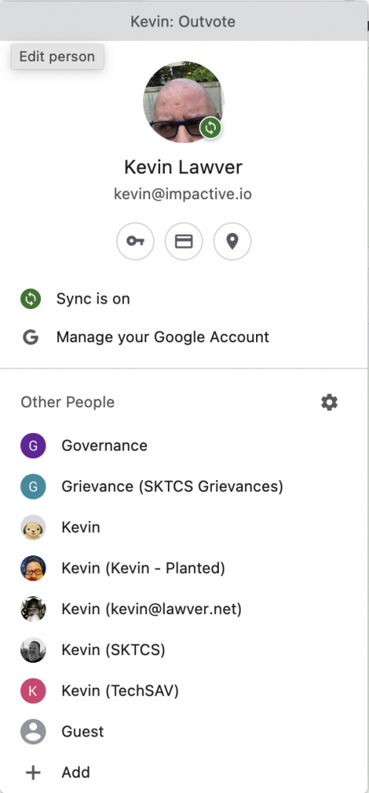

I have a lot of personas when I'm at the computer. There's me, the person, who has social media accounts and personal email and an Amazon account and various streaming services. There's [work me](https://www.impactive.io), who has gmail and a million github tabs open. There's [TechSAV](https://techsav.co) me, and several [SKTCS](https://www.sktcs.org) versions of me.

All of them have their own GSuite accounts, and various other things for getting things done.

I think I've finally got the setup for managing all of them without them running into each other too much! This post is very Mac-centric, but the guidance for Chrome still applies.

The trick is to stop trying to do everything in the same browser. Thankfully, with Chrome, you can create multiple profiles so you can keep your various identities distinct!

In Chrome, as long as you've logged into a Google account with it, will have your little user icon in the top of the menu bar. It should look something like this:

<figure>

<figcaption>

A screenshot of my Chrome menu bar showing my bald head... that's my user icon!

</figcaption>

</figure>

If you click your icon, you'll get a menu that shows your current Google account and then a list of your other profiles. If you don't have any, it's time to create some!!

If you click the **\+ Add** button, you'll be able to set up entirely new profiles that give you a "clean" browser experience so you can keep your various personas separate so you don't end up trying to join a Google Meet with your school account or wonder why you're not seeing that email from your boss when you're in your personal GMail.

That's great in isolation, but I get links that open browsers from email, text messages, etc... and I need a way to route them to the correct browser so I can handle them with the right persona. That's where things get Mac-like (I know there's something similar for Windows but I don't know what it is because I don't use Windows)! I installed [Choosy](https://www.choosyosx.com/) a few months ago and it's made this part of my life so much easier!

Choosy lets you choose which browser to open when you click a link from another application, and the coolest feature is that you can set up rules to open a specific browser based on the URL, which app you clicked on it from, etc. For example, I have a rule that says to open any URL with "outvote" or "impactive" in it in my Impactive Chrome profile, so I don't have to choose which browser to open every time I click a link to a Github ticket. Another rule is to open any link I click in my feed reader (the wonderful [NetNewsWire](https://netnewswire.com/)) in Firefox, which I use for personal stuff (I like that it fences Facebook things by default, and I love an underdog).

With this setup, I can keep my personas separate and make sure things open in the right place.
