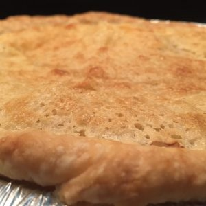
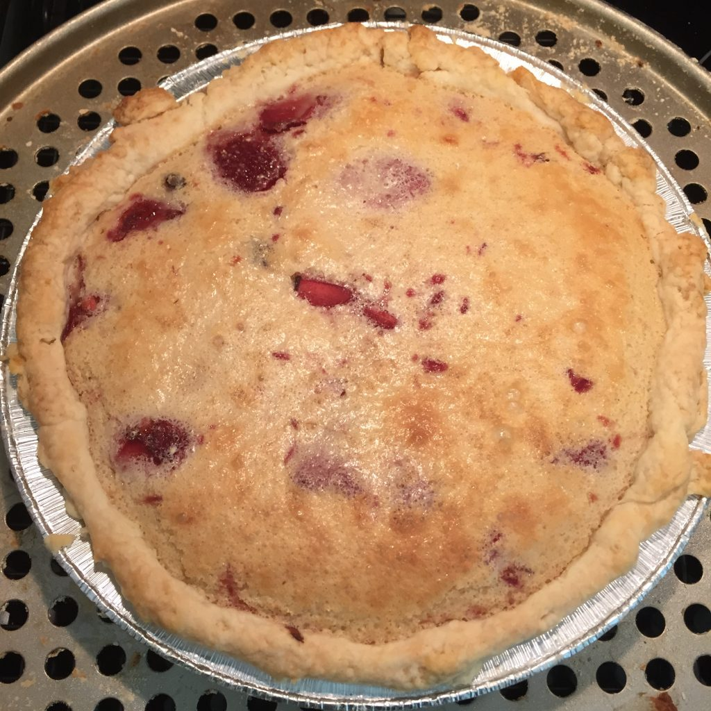

\[caption id="attachment\_127" align="alignnone" width="300"\] A close up of the incredible crust on top of the filling of the pie.\[/caption\]

I entered a pie contest. It's my first baking competition and I may have taken it a little _too_ seriously. I spent many weekend days experimenting with different kinds of chess pie, (because the [Chocolate Orange Chess Pie](http://www.cookeatwrite.com/2015/12/chocolate-orange-chess-pie/) was such a hit at Christmas, and chess pie is delicious!). I tried a Mexican Hot Chocolate Chess Pie, which didn't work, and then came up with the idea of a Chocolate Covered Strawberry Chess Pie and then spent a month trying to come up with a recipe that works.

This is the final product and the recipe that's going to the competition tomorrow. It's a lot of steps, but it's really not that much work, and the end result is totally worth it!

I'm writing this the day before the contest, so I don't know if it's an _award-winning pie_ yet, but it's darn good, so I'm sharing it with you!

This makes two pies (because I had to make two pies for the contest). They're so good, who doesn't want two of them?

## Ingredients for Pie Crust

- 2.5 cups of all-purpose flour
- 2 tablespoons of sugar
- 1 teaspoon salt
- 20 tablespoons of unsalted butter, cut into quarter-inch cubes
- .25 cups ice water
- .25 cups vodka, chilled (I keep mine in the freezer)

## Ingredients for Strawberry Compote

- 20 ounces stemmed and halved strawberries
- 2 tablespoons lemon juice
- 1 teaspoon honey
- pinch of salt

## Ingredients for Pie Filling

- 3 cups of sugar
- .5 cup all-purpose flour
- 6 tablespoons cornmeal
- 1 teaspoon salt
- 2 tablespoons of reserved juice from the strawberry compote
- 6 eggs
- 1.5 cups of cold buttermilk

## Ingredients for Chocolate Layer

- 2 cups dark chocolate chips (the better the chocolate, the better the pie)

## Pie Crust Directions

- Process 1.5 cups of flour, sugar and salt together in food processor until combined, about 5 seconds.
- Scatter butter over top and continue to process until incorporated and mixture begins to form uneven clumps with no remaining floury bits, about 15 seconds
- Scrape down bowl and redistribute dough evenly around processor blade. Sprinkle remaining flour over the top and pulse until mixture has broken up into pieces and is evenly distributed around bowl, 4-6 pulses.
- Transfer mixture to large bowl. Sprinkle vodka and water over mixture. Stir and press dough together, using stiff rubber spatula until dough sticks together.
- Divide dough into 2 even pieces. Turn each piece of dough onto sheet of plastic wrap and flatten each into a 4 inch disk. Wrap each tightly in plastic wrap and refrigerate for at least one hour (this would be a good time to make the compote).
- Before rolling out, let sit on the counter for 10 minutes to soften.
- When you place the pie dough in the pie pan and trim, leave half an inch outside of the pie pan, and then fold under, then flute. This will help hold in the pie filling when it expands in the oven and make a really yummy crunchy bit of pie crust!

## Strawberry Compote Directions

- Add all ingredients to a large preheated skillet over medium heat.
- Stir with a wooden spoon every couple of minutes to make sure things aren't sticking to the bottom.
- It's done when you can easily squish the strawberries with the back of a wooden spoon.
- Before you remove it from the heat, squish all the strawberries so they're crushed, but don't obliterate them.
- Put a wire strainer over a bowl, put the compote in the strainer and drain for at least 30 minutes. You should stir the strawberries in the strainer a couple of times to make sure you get as much liquid out as possible.

## Chess Pie Filling Directions

- Put all the dry ingredients in a bowl (including the sugar) and whisk together to combine.
- Add all the wet ingredients and whisk until smooth (for me, that's medium on my mixer with the whisk attachment for about a minute).

## Chocolate Directions

- Put chocolate into a microwave-safe bowl
- Put bowl in the microwave and microwave in 30 second increments, taking the bowl out of the microwave each time and stirring.
- Once you can stir the chocolate without leaving chunks, it's done. If it's close to done, only microwave it for 10 seconds at a time so you don't scorch it.

## Final Assembly

- After the crust is in the pan, pour half of the chocolate in the bottom of the pie shell.
- On top of that, spread half the compote on top of the chocolate.
- Now, pour half the pie filling on top of that. You want to leave at least a quarter-inch between the top of the filling and the top of the crust as the filling expands while cooking.

## Baking Instructions

- Put pie pan on a cookie sheet (they overflow sometimes) and bake on the top rack for 20 minutes.
- After 20 minutes, move to the middle rack and bake for 20 more minutes.
- You may need to add 5-15 minutes to the baking time depending on your oven. The pie is done when you can give it a gentle shake and you only get the tiniest of wobbles in the filling in the very center of the pie.
- When it's to that state, take it out and cool on a wire rack for 2 hours before refrigerating.

### Acknowledgements

- Pie crust recipe inspired by **Cook's Illustrated's The Science of Good Cooking** "foolproof double crust pie dough" recipe (I replaced the shortening with _more_ butter).
- Chess pie filling recipe was based on [Callie Spear's Chess Pie Recipe in Munchies](https://munchies.vice.com/recipes/chess-pie)

And here's a picture of one of the ones going to the contest tomorrow:

\[caption id="attachment\_129" align="alignnone" width="840"\] A finished chocolate covered strawberry chess pie.\[/caption\]
