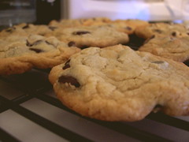

In case you didn't know, chocolate chip cookies are yummy. Max and I made a double batch while Brian was pretending to take a nap (he serenaded us over the baby monitor with babble-singing, then whining, then crying). They turned out _really_ well. The keys?

1. Use the Toll House recipe
2. Mix the sugar and brown sugar before adding the butter and then break up any clumps before adding the butter.
3. The butter should be about half softened / half melted
4. Use about a half a teaspoon more vanilla than it calls for
5. Use about half a cup more chocolate chips than you should
6. Use half semi-sweet toll house chips, half Ghiradelli bittersweet.
7. Cook them about a minute less than you think they need. There's nothing better than a gooey chocolate chip cookie.
