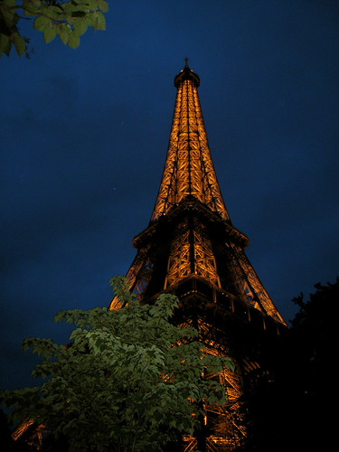

\\ Going up the Eiffel Tower is freaking scary! Why I ever thought it was a good idea, when I can't even stand by my hotel window and look down, is beyond me. Thankfully the top level was closed, so I only went to the second level. It took me 30 seconds to get off of the elevator and I couldn't get within 3 feet of the edge, even though there is a 12 foot fence all around the edge.\\ Yesterday I wandered around a local neighborhood, totally getting lost. I had my map, so I wasn't really lost, but it did take the map to get me back to the hotel.\\ Today's adventure is tackling the Paris metro in search of the Louvre. Wish me luck! I don't need too much though, because there are restaurants every 5 feet (so I know I won't go hungry) and I can always take a cab if I need to.\\ The French Presidency just switched power; it is super neat to be here for that. They didn't invite me to the ceremony though, so poo on them.
