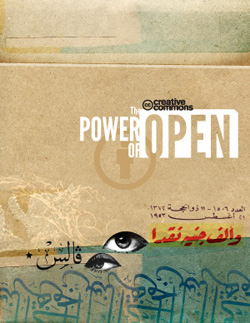

\[hang2column width="250"\]\[/hang2column\]

I've been a huge fan of [Creative Commons](http://creativecommons.org) pretty much since they launched. If you don't already know, Creative Commons provides several ways for you to license your work that expressly allow people to use it in certain ways. It's sort of copyright\*\* - allowing folks to do things with your work that they might not otherwise be able to do legally without a lot of complicated legal wrangling. For example, there are tons of CC-licensed photos on [Flickr](http://flickr.com). Depending on the license, you can use those photos for non-commercial work as long as you provide attribution, all the way to mashing them up in any way you want with absolutely no restriction. This blog has been CC-licensed since the beginning of Creative Commons. All of my [photos on Flickr](http://flickr.com/photos/kplawver) and [presentations](http://presentations.lawver.net) are too.

But, this post isn't about my blog. It's about [Ficly](http://ficly.com) (and ficlets, may it [rest in peace](http://ficlets.ficly.com/)). Back in 2006, when we first started working on ficlets, I wanted everything to be CC-licensed. Part of the motivation for that was so we could use share-alike licensed photos from Flickr. The other reason was that the share-alike license perfectly fit the premise of the site: anyone can add sequels or prequels to your stories. It took a _lot_ of convincing to get the AOL lawyers to sign off, but after they did some digging, they realized that they didn't have to do any work writing an additional Terms & Conditions document for the site, since the [Share-Alike Attribution license](http://creativecommons.org/licenses/by-sa/3.0/) (for the sticklers, out there, I think ficlets used by-sa 2.0) covered it all.

A few months ago, someone from the Creative Commons reached out and said they were writing a book of case studies of sites that use CC licenses and asked me if they could interview me. And of course, I said yes! Well, I'd totally forgotten about it until I got an e-mail that the book, [The Power of Open](http://thepowerofopen.org/) is out now, and my little interview made the cut! You can download the PDF from the site, buy a copy for yourself, or just [check out this screenshot of the page about Ficly](http://art.lawver.net/blog/power_of_open_ficly.png).

I'm proud to be a part of it, and proud of the ficlets and Ficly communities for creating and sharing almost 70,000 stories with the world.
