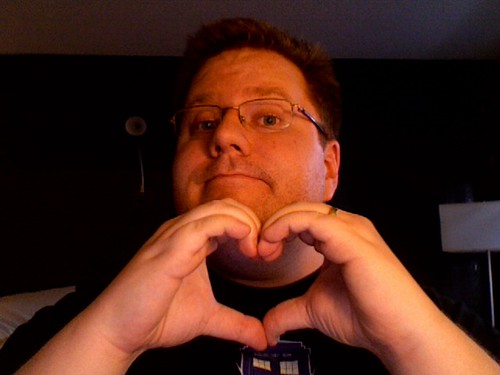

Jen [already posted her list](/archive/2008/01/23/h07_10_years_baby.php), but since I'm in California, I'm not late with mine. I honestly can't believe it's been ten years. It certainly doesn't feel like it. She said all the important stuff - that it's been way easier than we thought it would be, and while we've had "issues" over the years, we've figured them all out together and come out the other side stronger and happier for it. Jen puts up with a lot. I travel too much, work long hours, am distracted when I'm at home sometimes (part of my New Year's resolution, and I'm getting better, but it's still hard to switch gears) and other stuff that's not as important, but probably just as annoying.\\ Jen already gave a partial list of stuff that sticks out to me, but I was thinking about it last night, and here are some other things that have made the last ten years fly by:

- Jen's verbal dyslexia. I wrote a [blog entry about it a long time ago](/archive/2001/06/20/h13_so_we_were_trying_to.php) (thanks for finding it, Dave!), but she sometimes mixes up the first syllable of two words (like "toin coss" instead of "coin toss"), and then gets this look on her face like she knows she just said something funny but can't figure out what. My all-time favorite is "Moodist Bunks".
- It's that we're pretty much [always making things fun](/archive/2003/01/23/h22_sexy_sexy_buuuuuuuurp.php), no matter how stupid, icky or menial they are.
- She [makes me want to be a better man](/archive/2003/01/23/h09_5_years_ago.php).
- She's understanding and never makes me feel bad about things I can't control.\\ Like I said [five years ago](/archive/2003/01/23/h09_5_years_ago.php), I'd do it all again in an instant. The sun _definitely_ still shines out your ass, sweetie, and you're gorgeous (if you haven't seen **Juno**, you really should). Actually, since both of our asses have "settled" a little over the years, it shines even brighter.\\ I love you.
