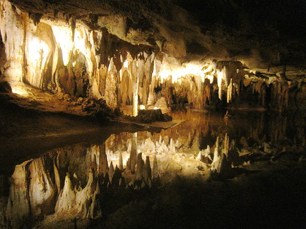

We decided to get out of the house yesterday and take a drive. It's been a stressful few weeks at Chez Lawver and we needed a break. So, we piled the boys in the car with snacks, paper, pens and books and headed out to the country to go [play in a cave](http://luraycaverns.com/). We've lived here for eight years, and I didn't realize how close we are to the mountains. Silly Kevin.\\ The drive was less than two hours, with great scenery on all sides, and only about half of it on a major highway.\\ The boys were lovely, as usual, and they both _loved_ the cave. Brian was constantly tugging on us to "walk faster" so we could see more. They were constantly looking up, around and pointing at stuff for us to look at.\\ I took over three hundred pictures and only ninety or so came out. I uploaded [fifty of them over on flickr](http://www.flickr.com/photos/kplawver/sets/72157602425209049/). Jen says they look better than the postcards she didn't buy (which makes me really happy). I tried to avoid using the flash, except when I was taking pictures of people. I think they came out pretty well.\\ [Luray Caverns](http://luraycaverns.com/) also has a little car museum... emphasis on _little_. Brian pointed out almost every car saying "I want that for my birthday!" excitedly. Well, I'd love a Rolls Royce Silver Ghost too, kid, but that ain't happenin' any time soon. I did get some good shots of hood ornaments though. My personal favorite is the [archer on the front of the Pierce Arrow](http://www.flickr.com/photos/kplawver/1576782223/).\\ We're planning on taking more day trips out to the middle of nowhere in the near future. Suggestions are welcome!
