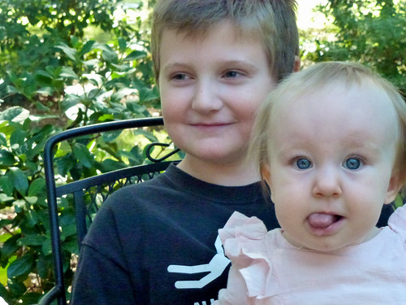

We went to my co-worker Juliet's birthday party on Saturday and my other co-worker, Steven, brought his daughter. Brian also had a project last week at school where he had to take care of a tiny pumpkin like a baby, so we'd been having lots of chats about what it was like to have a baby. Brian told me he couldn't remember ever holding a baby before. I tried to remind him of the time he [held a baby](http://www.flickr.com/photos/kplawver/481666669/in/photostream/) at Uncle Tim's birthday party in Ohio, but he didn't remember it.

So, the day before the birthday party, I asked Steven if we could "borrow" Stella at the party. Brian was an absolute champ with her, and Stella was an angel. She's the coolest and calmest baby I've ever seen and had a ball laughing at everyone and being the center of attention. Brian was super gentle and did a good job holding her and keeping her from tumbling onto the lawn.

I think the reason I love that photo so much is that it sort of cements that Jen and I don't have "little" kids anymore. The boys are growing up and we have entirely new things to deal with - no more dirty diapers, but we get to deal with peer pressure, girls, school projects and trips, parties, etc. I kind of miss having babies around, but I don't think I'd trade places with Steven. We did the baby thing, and now it's time to do this.
