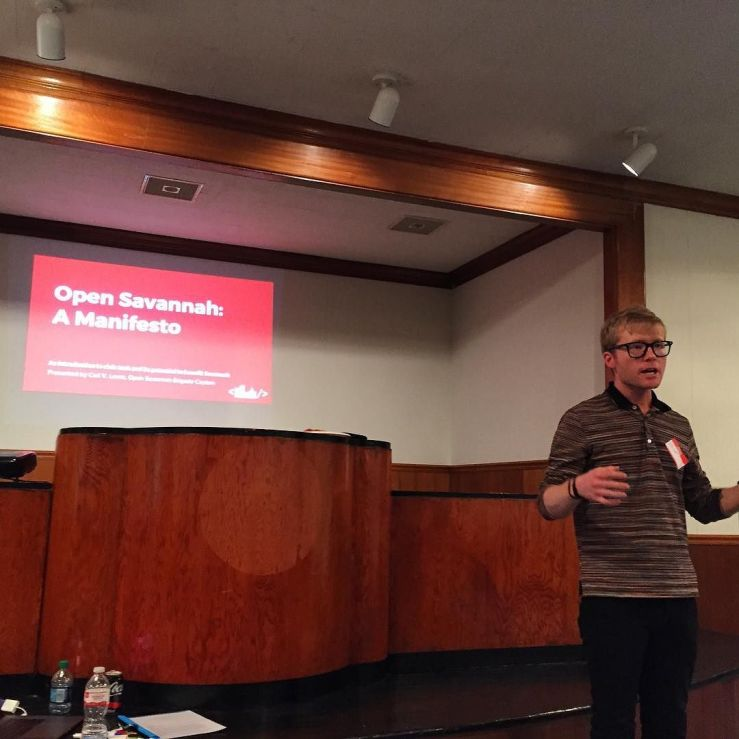

This month, I lost a friend. [Carl V. Lewis](http://carlvlewis.net/cvlinteractive/) was the founder of [OpenSavannah](http://opensavannah.org), and a friend. He died, and we don't know how or why. All I know is that he's gone, and I'm going to miss him.

I found out very close to the one year anniversary of [losing Cindy](https://lawver.net/2018/10/my-friend-cindy-li/).

Carl meant a lot to the Savannah community. He was a catalyst - impatient, insistent, impulsive. To offset all of those things, he was thoughtful, brilliant and kind in a way that frequently surprised me. He knew suffering and seemed to be on a quest to alleviate others' suffering by working on the systems that had the greatest potential to help them: local government.

Now that he's gone, Savannah has to piece OpenSavannah back together, figure out all the clues Carl left us, and keep moving forward. I'm not sure how we do it, but it's consuming my thoughts right now.

I don't really know what else to say, other than we'll miss him, and we'll find a way to keep going.

<figure>

<figcaption>

Carl kicking off Open Savannah in 2017

</figcaption>

</figure>

All of the not-knowing about Carl's passing has made me think a lot about the support systems we have in place for the people we care about. A lot of people have asked me what I know, what happened, and then lament that they personally didn't do more.

I don't know what his friends could have done, because **I don't know what happened.**

But, in been thinking about what we owe the people in our lives, here's what I think right this minute:

- I want everyone I meet to feel nothing but loving kindness from me.
- I want everyone I meet to feel safe and comfortable around me.

In a religious context, that's just the **Golden Rule**. But, it means working on my emotional regulation. If my friends and family don't know what to expect when they tell me things, then they're not going to feel safe. If I'm having a bad day, _and take it out on other people_, they're not going to feel loving kindness. Even if I'm having a disagreement or other conflict with someone, I still want them to feel that same loving kindness. I think the end goal is that **I don't want to add to someone else's suffering**. There's more than enough to go around.

I am so very much not there yet, but that's what I aspire to. I owe it to Carl, Cindy, and the people still here to work on it, because we don't know how many days we or they have left. I'd rather fill the time left with kindness.
