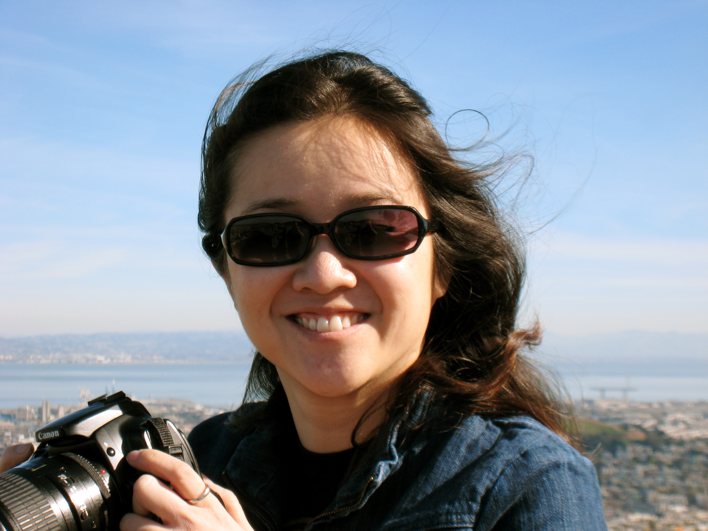
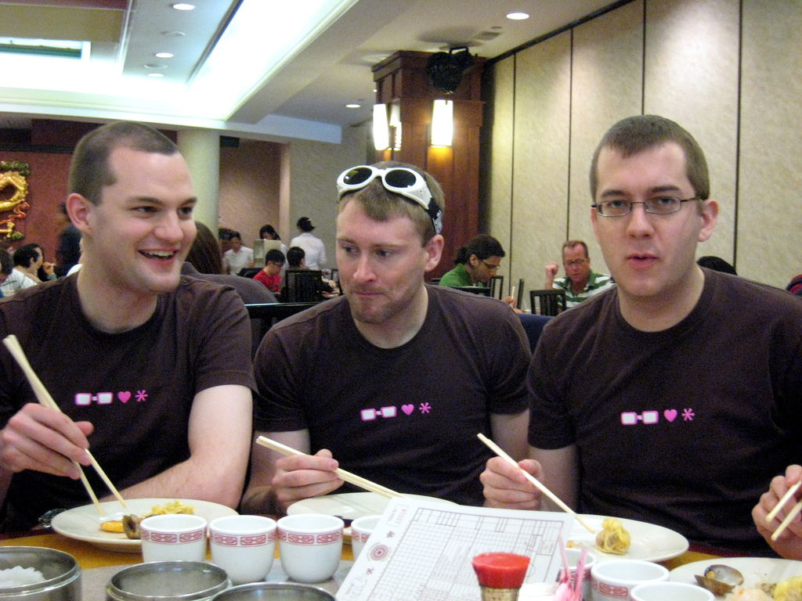
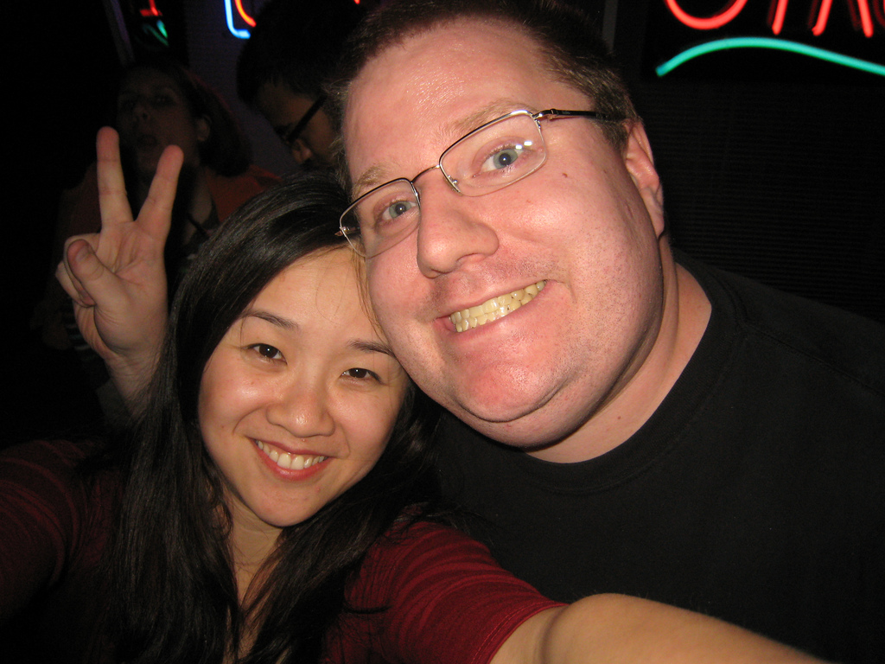
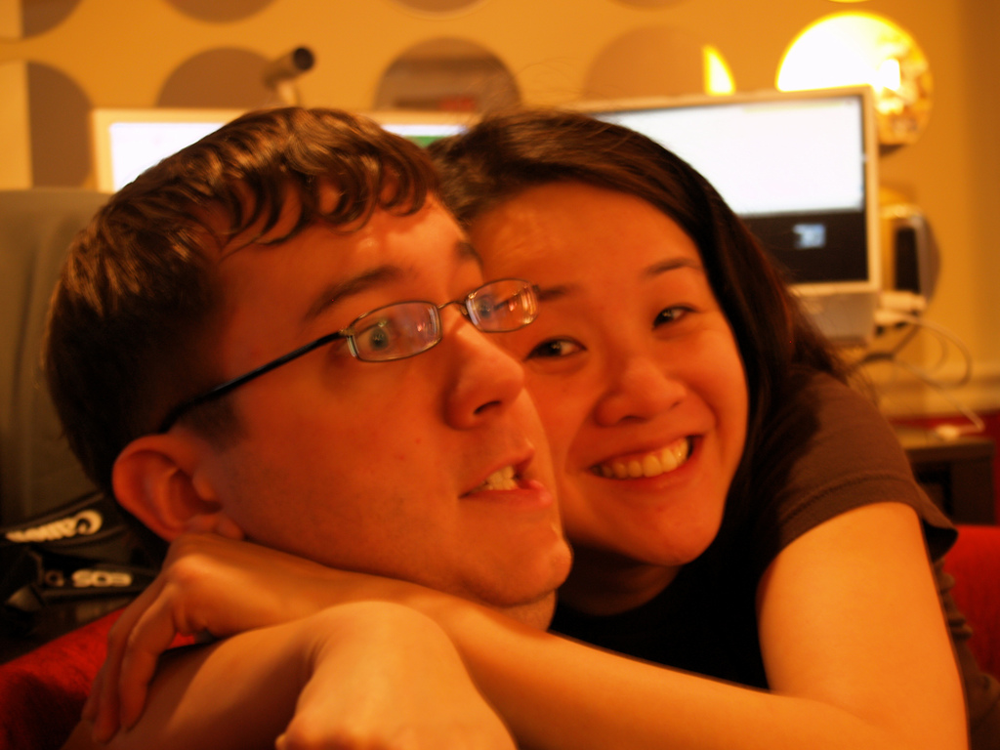
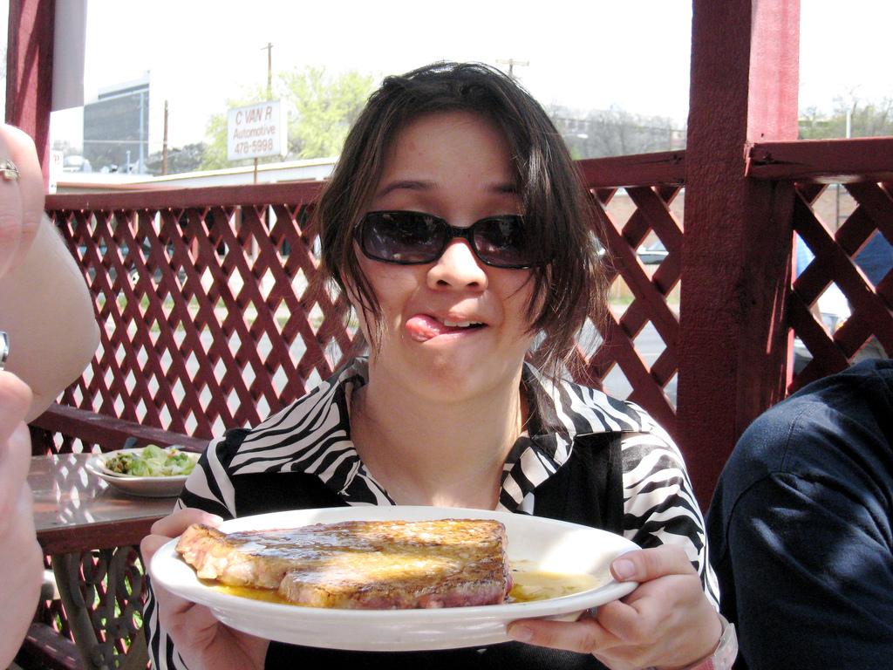

<figure>

<figcaption>

Cindy Li smiling on top of Twin Peaks in San Francisco

</figcaption>

</figure>

I've worked with hundreds, if not thousands, of people over the years.  I've liked most of them, been friends with a lot of them, and loved many of them.  Cindy was definitely in the last category.  

Cindy Li and I became fast friends and co-conspirators while we both worked at AOL.  We were on the CSS Working Group together.  We went to SxSW Interactive many many times (we had different but overlapping "gangs" at SxSW but we always intersected somehow during the conference - sometimes in the green room, where we'd try to distract each other's panelists).  We went to countless dinners, lunches and [dim sum brunches](https://cindyisawesome.lawver.net/posts/kevin/dim-sum-boyfriend/).  We caused trouble.  With our pal [Jason](https://sixtwothree.org/), we built ficlets and came up [with a t-shirt that became a bit of a sensation](https://cindyisawesome.lawver.net/posts/kevin/geeks_love/).

<figure>

<figcaption>

Matt Harris, Patrick Haney and Jason Garber sporting the Geeks Love \* shirt at dim sum.

</figcaption>

</figure>

**Cindy died on Monday, 10/15/2018.** Cindy was _amazing_. She was equal parts creative, silly, kind, funny and smart.  She was a perfect co-conspirator.  She could take bad ideas and make them brilliant.  She effortlessly seemed to rally people to join the **Cindy Li Vortex of Fun Adventures.**

<figure>

<figcaption>

Cindy and Kevin making stupid faces for the camera.

</figcaption>

</figure>

<figure>

<figcaption>

Cindy tormenting Jason, one of her faaaavorite pasttimes.

</figcaption>

</figure>

<figure>

<figcaption>

Cindy, about to chow down on a steak at Austin's Hoffbrau

</figcaption>

</figure>

Cindy brought people together.  She was the ultimate connector, and even though she's gone, the connections she made with all of the people she impacted all over the world will remain.  After she was diagnosed, Cindy organized a small group of friends from all over the world into her support system.  We were all around, talking to each other about how best to help her and her family, and the whole while she was sick, she was there being the life of the party, right up until the end.  Even with her illness, she was connecting people and spreading love, kindness and empathy.  

She was a vortex of love, and fun, and whimsy, and adventure, and you weren't just along for the ride, you were an integral part of it. I don’t think anyone who knew Cindy thought they were anything less than 100% included and in on the joke, and that’s a rare and beautiful thing.  She was that way until the day she left, I imagine riding a Hello Kitty cloud on her way to organize an adventure with St. Peter and redecorate the gates of Heaven.

Her friends organized a [site for sharing memories of Cindy](https://cindyisawesome.lawver.net) as a way to share with her how much she means to all of us, and as a way for her sons to understand what she meant to us when they're older.  You can share your own memory of Cindy by following the instructions there, read her obituary, and help her kids out if you're able.
