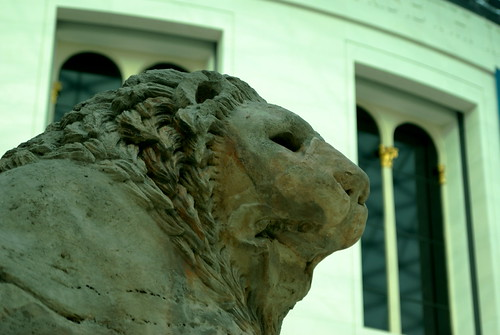

This was my second trip to The British Museum. My first was in October of 2007 with a friend from AOL, but we could only stay for about an hour. That's not nearly enough time. We only got to see the Rosetta Stone, some mummies and a little bit of the Assyrian collection.\\ My only touristy goal on this trip was to really dive in and see a _lot_ more of the museum. And boy, did I. [Ann](http://www.pixeldiva.co.uk/) and [Tobey](http://workingasintended.co.uk/) met me, and we spent a great almost four hours wandering through history. I won't go in to _how_ the museum came to possess its collection, but it is _amazing_. If you get the chance to go to London, give yourself a good half-day to wander through it. It's truly unbelievable.\\ I took almost three hundred pictures, so it's going to take me some time to upload them. They'll all end up [in the set on flickr](http://www.flickr.com/photos/kplawver/sets/72157613277750440/) eventually.\\ I was particularly fascinated by the statues from India and Asia, especially the ones depicting Hindu deities. If anyone has recommendations for a "beginners guide to the history of Hinduism", I'm all ears.
