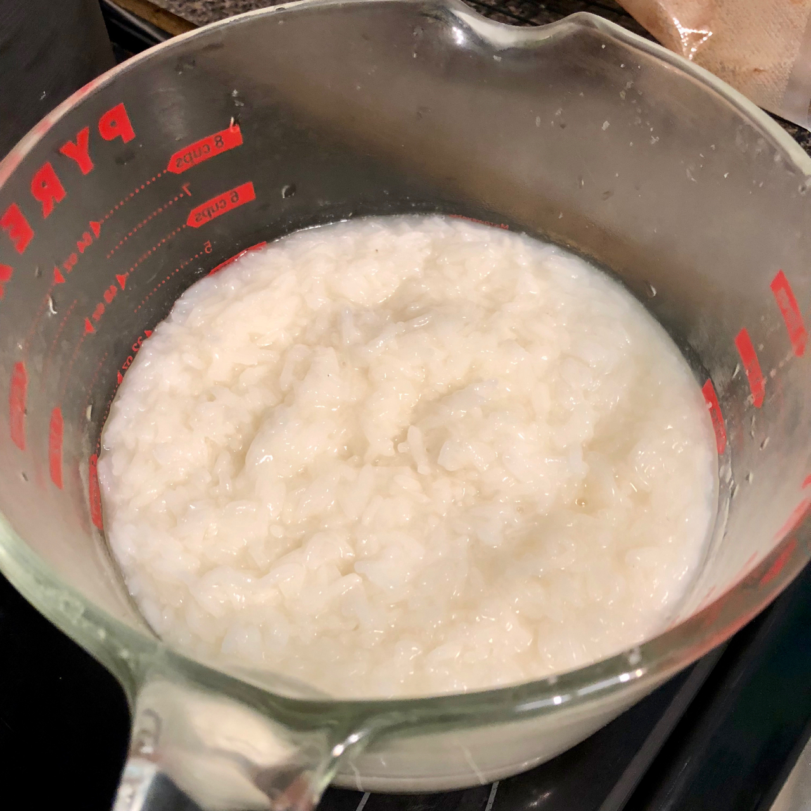
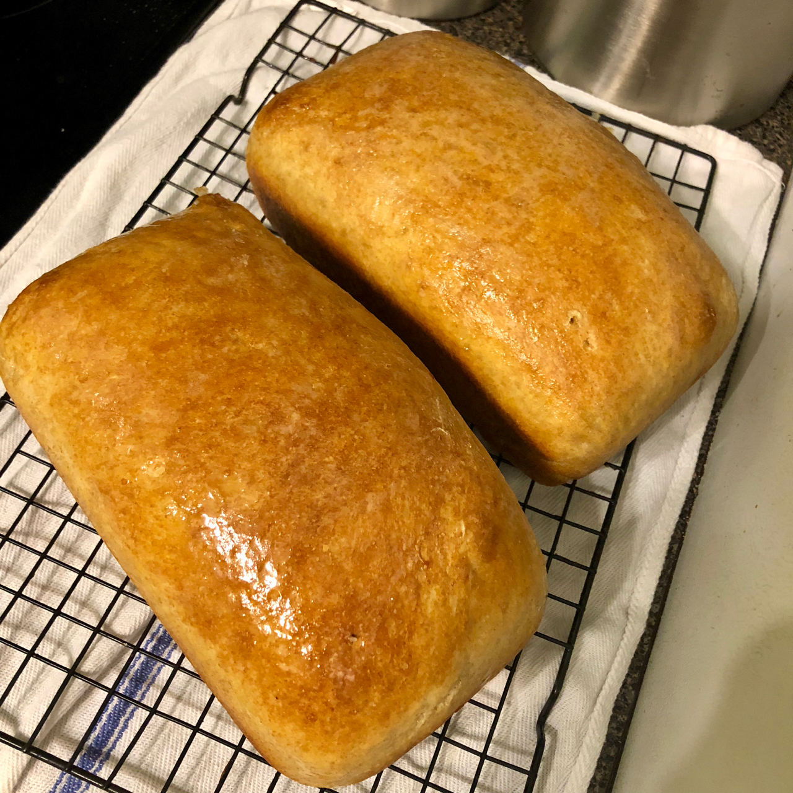

I've had this obsession with old community cookbooks for a couple of years now, snatching them up whenever I find them at thrift stores, flea markets, etc.  There are two shelves on our big bookcase full of spiral bound journals of recipes from as early as 1933 and as late as 1991.  Honestly, I prefer the older ones.  Starting in around 1960, everything has at least one tin of salmon or tuna and a bucket of mayo in it.

Then I found **The Carolina Housewife**, which isn't _really_ a community cookbook.  It was published in 1847 anonymously, but most likely written by Sarah Rutledge.  I found a copy on Amazon, but it was just scanned pages, and almost impossible to read...  but what I read had me hooked.  No easy-to-read list of ingredients and step by step instructions.  Each recipe is a paragraph, full of lots of assumed knowledge (that I don't have).  I was so fascinated, I found and ordered an old library copy on eBay and have this crazy idea that I'm going to take all the bread recipes, update them with modern ingredients and publish them.

But, I kept putting it off.  The recipes are _intimidating_.  But, I finally found my first one, **Carolina Rice and Wheat Bread**.  It took a few attempts, but I think I've got it.

### The Original Recipe

>  Simmer one pound of rice in two quarts of water until it is quite soft; when it is cool enough, mix it well with four pounds of flour, yeast and salt as for other bread; of yeast, four large spoonfuls. Let it rise before the fire. Some of the flour should be reserved to make the loaves. If the rice swell greatly, and requires more water, add as much as you think proper.
> 
> The Carolina Housewife by Sarah Rutledge

### My Version

I didn't attempt to make my own yeast for this, and it took a couple of attempts to get to this point.  Since I have no description of the taste, texture or appearance, I just baked them in loaf pans, and well, they turned out fine!  The long ferment in the fridge helps it develop flavor.  My first attempt didn't really taste like anything.  This one, with the addition of the whole wheat flour and the longer ferment, still has a subtle flavor, but I think it's really good.  And don't worry about lumps of rice!  I have no idea HOW, but it all gets absorbed during mixing and kneading.

This recipe should make two large loaves.

#### Ingredients

- 1 cup rice
- 1 quart (4 cups) water (for the rice)
- 1.5lb all-purpose flour
- .5lb whole wheat flour
- 1 cup of water (for the dough)
- 2 tablespoons active dry or instant yeast
- 1.5 tablespoons salt

#### Directions

- The first step is to make the rice.  In a large saucepan, heat the rice, quart of water and a healthy pinch of salt over medium heat.  Once it starts bubbling, turn it down to medium low and simmer uncovered until the rice has absorbed almost all of the water and is really soft and sticky. 
- Let cool to room temperature, or throw it in a bowl and refrigerate overnight.
- Add the now-cooled rice to the bowl of your mixer, add the flours, yeast and salt and mix on low with the dough hook until the rice breaks up and the flour starts mixing with it.  Slowly add the water, about a tablespoon at a time until a shaggy sticky dough forms.  Depending on how much of the water is left in the rice you might not need all the water.  It should be just wet enough that all the flour gets absorbed into the dough.
- Once you've got the shaggy sticky dough going on, turn up the mixer to 2 or 3 and knead until the dough gets smoother and pulls away from the side of the bowl, about 5-7 minutes.  It's still going to be sticky, but hey, that's the rice!
- Scrape the dough into a large oiled bowl, cover with plastic wrap or oiled aluminum foil and throw it in the fridge for 36-48 hours.  Check on it a couple times a day and punch it down if it looks like it's going to jump out of the bowl.
- Take the dough out of the fridge, cut the dough in half, form into loaves and put them into oiled loaf pans.  Let rise on the counter covered with a towel for 2.5-3.5 hours until they've doubled in size and a peeking over the top of the loaf pans.
- Bake in a 350 degree oven for 40-50 minutes until they reach an internal temperature of 195-200 degrees, then take the out of the oven, remove them carefully from their pans, rub a stick of butter over the top of the crust, and let cool on a rack as long as you can stand it!

<figure>

<figcaption>

This is what my rice looked like after cooking.  It's... not super appetizing, but it works!

</figcaption>

</figure>

<figure>

<figcaption>

Another view of the final product!

</figcaption>

</figure>

This recipe is still a work in progress.  If you try it, let me know how it goes!
