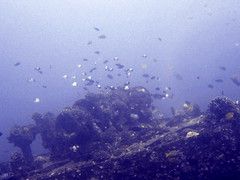

\\ Some days, it feels like I'm going through life under water.\\ But in other news, I go to the doctor bright and early Monday morning and find out if I can finally wear a normal shoe on my right foot. It will have been over six months since I started wearing either the **Velcro Nightmare**, a cast, a post-op splint/wrap/ace combo, an ace bandage or the **Strappy Terror**.\\ My physical therapist did my "report card" that I have to take to Dr. Wilson on Monday, and my range of motion is greatly improved, and I took my first _real_ steps on Friday morning outside of the boot. Not much pain, just a little tightness, and some swelling.\\ Oh, and I am now the proud owner of the home version of the electrocution machine they hook me up to after every visit. I think I'm going to see if I can make Max smile...
