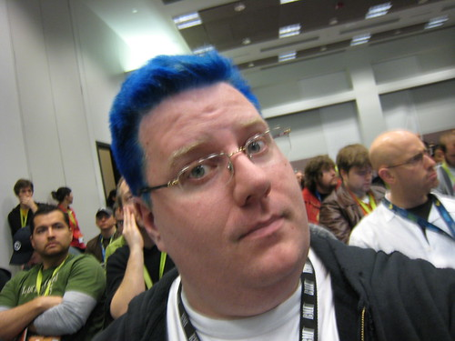

I'm in Austin for SxSW Interactive 2008. I've been really busy with preparing for panels, worrying about panels, worrying about the [web awards](http://2008.sxsw.com/interactive/web_awards), dying my hair blue, etc. Here are some of the highlights of the week:

- **Career Transitions: From DIY to Working for the Man**: I moderated a panel about the pros and cons of working for large corporations, startups, the government, freelancing and academia. The panelists were awesome: [Jason Garber](http://sixtwothree.org), [Leslie Jensen-Inman](http://morellc.com), [Cindy Li](http://cindyli.com) and [Thomas Vander Wal](http://vanderwal.net). I think the panel went pretty well, and hopefully helped some people out.
- [Ficlets won a SxSW Web Award!!!!](http://ficlets.com/blog/entry/we_won) - I couldn't be prouder. I posted about it over on the [ficlets blog](http://ficlets.com/blog/entry/we_won) (it has my acceptance speech too). [Jason](http://sixtwothree.org) deserves most of the credit, but I'm keeping the trophy. [Mr. Scalzi just blogged about it too.](http://scalzi.com/whatever/?p=483)
- I dyed my hair blue for [The International Day of Awesomeness](http://dayofawesomeness.com). I've always wanted to, but never had the guts. Since the holiday is all about performing and celebrating feats of awesomness, I knew I had to do it. So, I spent Monday morning dying my hair and ruining hotel towels.
- I got interviewed by New Riders (my publisher). It's in the **Voices That Matter** podcast on iTunes, and they said it should be on YouTube some time today. And, [here it is](http://youtube.com/watch?v=Ikh6sCjzzZs)!
- I got interviewed by the [AOL Developer Network](http://dev.aol.com) about ficlets and SxSW. No idea when that'll go up.
- I got to hang out with my friends at great events like **Fray Cafe** and [20x2](http://20x2.org).\\ I'm headed to California bright and early tomorrow morning and could really use a nap.
