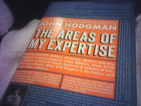

[Reading...](http://www.flickr.com/photos/kplawver/82044549/)\\ This review may be a little weird. I read it solely while either getting heat or ice at physical therapy. I loved it. It's ridiculous, in the way the best Monty Python skits are ridiculous. It's smart, well-written and extremely sly. The jokes are constant, and really really funny. If you think the following things and people are funny: Dave Eggers, **Good Omens**, **McSweeney's** or, **The Onion**, you'll love this book. Now I have to find something else to read while getting cooked, frozen and electrocuted. I've been reading **The Meaning Of Everything**, which is really good (almost done... can't wait to see how it turns out! do they finish the dictionary??!!), but dense. It takes concentration to read, which I don't really have when being tortured... any suggestions?
