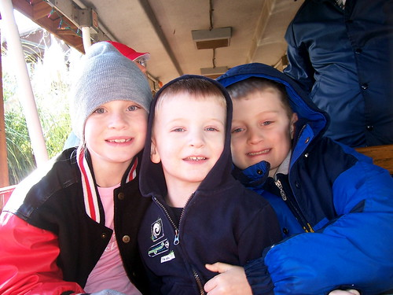

The pictures from the trip are up and organized into sets. Here they all are:

- [Day One](http://flickr.com/photos/kplawver/sets/72157594449873298/) - This included sledding, and dinner at Leatha's: the Temple of Pork.
- [Max Takes Pictures](http://flickr.com/photos/kplawver/sets/72157594449895132/) - I let Max use the camera and iPhoto to take pictures around the house. He loved tweaking all the settings on pictures, and trying out crazy stuff. He really got into macro mode, as you'll see. There's some really good stuff in there.
- [Dinner Out, and the Lights of Tylertown](http://flickr.com/photos/kplawver/sets/72157594449911362/) - Little tiny Tylertown, Mississippi puts on a great light show. Unfortunately, the batteries in the camera died before we could document the whole thing.
- [Christmas Eve and Day](http://flickr.com/photos/kplawver/sets/72157594449951595/) - Including the requisite tree shots.
- [Jen Takes the Boys for a Walk](http://flickr.com/photos/kplawver/sets/72157594450005273/) - Some really funny Max and Brian moments in this one.
- [The Hattiesburg Zoo](http://flickr.com/photos/kplawver/sets/72157594450133946/) - We went to the zoo! It was small, but the kids had fun and got to ride on a train.
- [Around the House and Out and About](http://flickr.com/photos/kplawver/sets/72157594450042721/) - Random stuff from the trip that doesn't fit anywhere else. See little Brian pig out, ride a tractor and the Great Sundae Massacre of 2006.\\ Enjoy!
