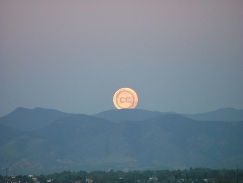

  
\\ \[Creative Commons Moon\](http://flickr.com/photos/denverjeffrey/301014978/) by Jeffrey Beall

In the past two days, people have e-mailed me to ask if they could use photos of mine for:

- A short-run calendar ([Downtown Boston At Night](http://www.flickr.com/photos/kplawver/5901653/))
- An illusion as part of a [mentalists'](http://www.flickr.com/people/31117525@N05/) stage show. (not sure why he wants to use [this one](http://flickr.com/photos/kplawver/55652786/), but he does)\\ In the past, people have asked to use my photos in:
- [a history textbook](http://flickr.com/photos/kplawver/3955927/) (it might have been a different one)
- several websites
- a cookbook (he wanted to use a couple of [my beach pictures](http://flickr.com/photos/kplawver/sets/72157606211412901/))
- presentations
- several news stories on [Now Public](http://nowpublic.com)\\ In every response I send, this is pretty much what I say:\\ bq. Of course you can use my photos in _insert use here_. All my photos are licensed under [Creative Commons](http://creativecommons.org), so as long as you provide attribution and your work is also licensed under Creative Commons, then you're free to use any of my photos however you want.\\ I'm surprised how many people that surprises, but I probably shouldn't be. [Creative Commons](http://creativecommons.org) is a great tool for creative people to share their works while maintaining some control over how they're used. I love that [Flickr](http://flickr.com) allows people to choose from several different licenses and displays it alongside every photo. They were a big influence on our choice to make all the stories on [ficlets](http://ficlets.com) Creative Commons licensed as well.\\ Now, when people don't want to release their work under the same license as my photos, we can talk. And, in the case of the calendar, I **sold my first photo**! They're actually _paying_ me to use that picture, which I think is crazy (awesome, that is). I'm not a professional by any stretch, and that picture was taken with my crappy old Kodak point and shoot. Honestly, I think they should use one of my [aerial Boston shots](http://www.flickr.com/photos/kplawver/sets/72157594489140386/), but whatever.\\ So, thank you, [Creative Commons](http://creativecommons.org) for giving me an easy way to license my content that encourages sharing, and thank you [Flickr](http://flickr.com) for giving me an easy way to share my photos. You're awesome!
