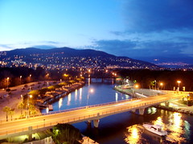

[Time-Lapsed Sunset](http://www.flickr.com/photos/kplawver/109241232/)\\ I finally got the pictures off the camera and will try to get them all up before leaving for Texas. I think this is my favorite one so far (I haven't look at all of them yet - I have to work and stuff). It's a two second exposure of the last moments of sunset on the day I arrived. I was really tired (didn't sleep on the plane) and just waiting until a reasonable hour before crashing. I was so happy to be back in France, yet entirely exhausted. I love Mandelieu. I got to know the area a little better this time because I rented a car, and it hasn't made me love it any less. The people are friendly. The food is amazing, and the scenery is breathtaking. You should go.
