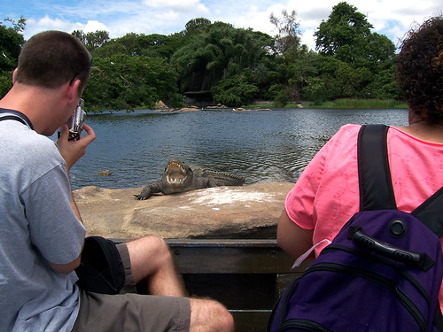
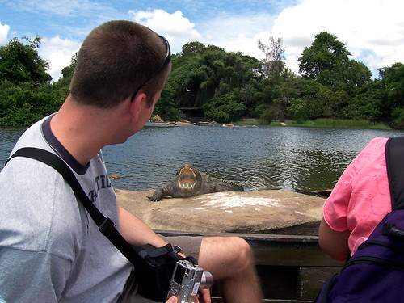

These aren't great from a photography standpoint, but they tell a story that still makes me crack up.\\ There were eight Americans in a row boat (rowed by a tiny Indian man) in a bird sanctuary. Our driver promised crocodiles. The guy rowing the boat lifted up his oars as we got close to a large (we guessed about 14 feet) and said "Watch this!" We drifted in towards this very large fellow sunning himself on the rock.\\ The boat drifted closer and closer and eventually stopped with a thud against the croc's rock. The croc wheeled his big head around, opened his mouth and hissed. Cliff was zoomed in all the way and thought it just _looked_ like we were close the the gigantic angry crocodile.

When the croc hissed, Cliff lowered his camera, sprang back and screamed "\*Oh dear, **crocodile**!!"

Still makes me giggle...
