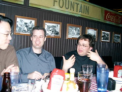

[The Boys Are Animated](http://www.flickr.com/photos/kplawver/6309210/)

Last year, we met the [Browns](http://chatterwaul.com) at Threadgills on Thursday night before SXSW began. This year, the crowd got bigger, with the addition of [Kevin Smokler](http://wheretheressmoke.net), [George](http://allaboutgeorge.com), [Tim](http://timothompson.com/journal/) and [Neil](http://beatnikpad.com). We had a great time!!! I got to play with the kids, we talked about all kinds of things, I installed [Movable Type](http://sixapart.com), [Instiki](http://instiki.org) and Sogudi on George's laptop, and we laughed... a ton. Oh yeah, I think I set the new land speed record for installing and rebuilding MT - three minutes from beginning to first post posted and site rebuilt. Can you beat that?
