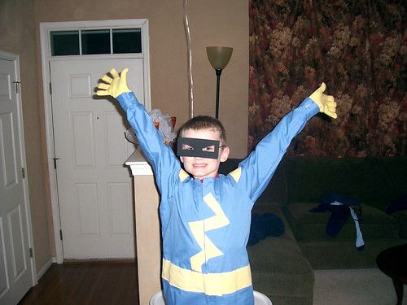
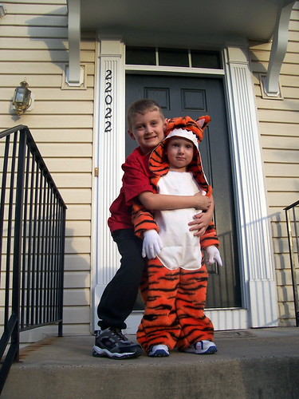
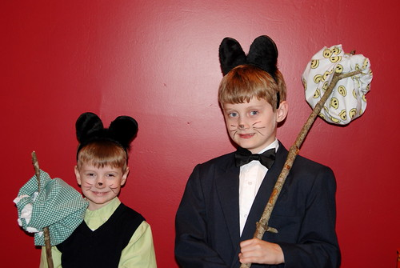
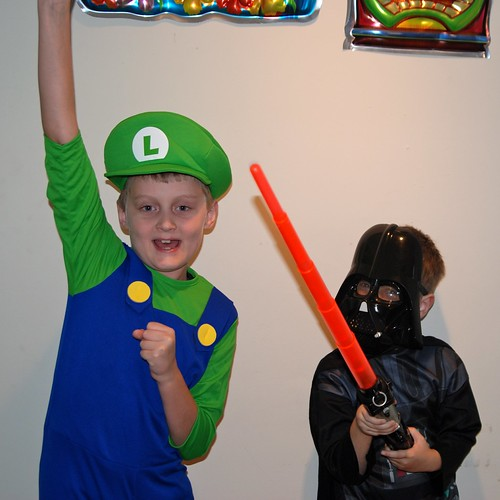
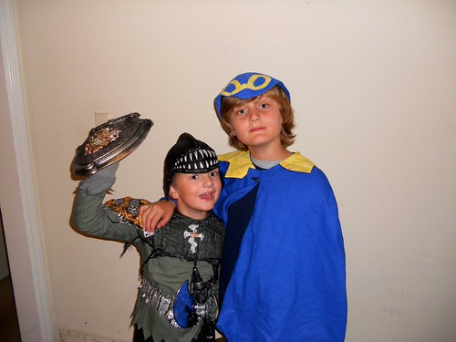
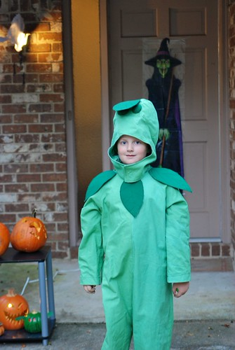
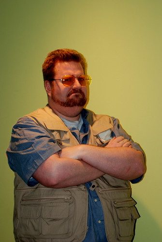

Sometimes, especially Halloween, I can't help but think I've somehow ruined my children. Every year since they've been old enough to pick their own costumes, they've gone as something so obscure and webby that we end up having to explain it at every house we go to. That's doubly true since we moved to Savannah and most of our neighbors are retired.

Here's a quick recap of the last few Halloweens:

\[hang2column element="div" width="500"\]\[/hang2column\]

\[hang2column element="div" width="500"\]

2006: Max was both Calvin and Spaceman Spiff. Brian was Hobbes.\[/hang2column\]

\[nohang\]Crazy enough, in 2007, they were [a tiger and an elephant](http://www.flickr.com/photos/kplawver/sets/72157602827709174/[/nohang])

\[hang2column element="div" width="500"\]

2008: Max and Brian from Abe Koford's awesome web comic, [Laugh Out Loud Cats](http://apelad.blogspot.com/.[/hang2column])

\[hang2column element="div" width="500"\]

2009: This one wasn't so obscure... Max was Luigi and Brian was Darth Vader. We still had to explain Max's costume to the neighbors.\[/hang2column\]

\[hang2column element="div" width="500"\]

2010: Max as Geno from **Super Mario RPG** and Brian as Link from **Legend of Zelda**.\[/hang2column\]

\[hang2column element="div" width="500"\]

And 2011: Brian as a Peashooter from **Plants vs. Zombies**. Max decided not to dress up this year after failing to manufacture all the pieces he needed to be Gordon Freeman from **Half-Life**.\[/hang2column\]

\[hang2column element="div" width="500"\]I have no idea where they get it from...

\[/hang2column\]

\[nohang\]Happy Halloween, everybody!\[/nohang\]
